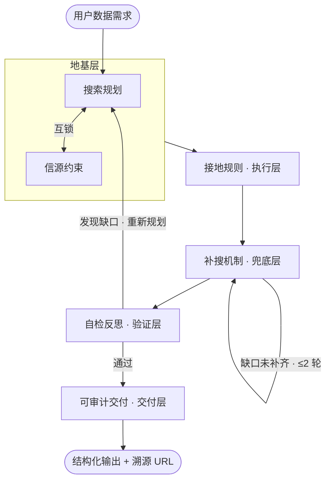

# 可信检索 Skill

> 先规划后检索的人口数据 Skill：官方优先，多源验证。
> 无源不输出，缺数不妄言，冲突不站队。

一个让 Agent 可靠检索数据的 Skill 集——当前包含人口数据检索，后续扩展至上市公司销售数据等窄领域。核心不是「能搜到数据」，而是「搜到的数据可信、可追溯、可审计」。

---

## 快速开始

1. 下载 Skill → [GitHub Releases](https://github.com/paperpoon-lang/trusted-retrieval-skills/releases)
2. 放入 Agent 的 `skills/` 目录
3. 直接问：「中国 2024 年总人口」、「日本 TFR」

支持所有遵循 [Anthropic Agent Skills 开放标准](https://github.com/anthropics/skills) 的 Agent 工具。

---

## 架构

## 模块

| 模块 | 一句话 | 防止的失败 |
|------|--------|-----------|
| **信源约束** | 6 级官方信源白名单 + 独立性判定 | 搜错信源（百度百科、维基百科） |
| **搜索规划** | 需求四维分析 + 国家→统计局映射 + 本地化关键词 | 不知道搜什么、搜不到外语数据 |
| **接地规则** | 只回答本轮检索到的数据，永不凭记忆 | 凭训练数据「编造」数字 |
| **补搜机制** | 门控补充检索（最多 2 轮）+ 高敏感指标强制触发学术库 | 一次搜不到就放弃、TFR 等指标缺少学术验证 |
| **自检反思** | 五维检查（完整性/可追溯/时效性/一致性/边界） | 交付了错的、缺了的、过时的 |
| **可审计交付** | 结构化输出 + 溯源 URL + 冲突不选边 | 用户无法验证数据来源、数据打架时 Agent 替用户下判断 |

---

## 为什么这样设计

每个模块都是从一个具体的失败模式倒推出来的——先问「它在什么情况下算废了」，再问「怎么防住」。

| 失败模式 | 倒推出的设计决策 |
|----------|-----------------|
| Agent 搜了百度百科当权威数据 | 信源白名单 + 6 级优先级，禁止使用百度百科、维基百科、知乎 |
| Agent 用训练数据「记得」的数字回答 | 接地规则：只能输出本轮实际检索到的内容 |
| 一个信源搜不到就报告「未找到」 | 门控补搜：每轮明确缺口，最多 2 轮，关键词逐轮调整 |
| 日本 stat.go.jp 和 soumu.go.jp 被当成两个独立信源 | 独立性判定：同属総務省 → 识别为同一机构 → 补搜第三方 |
| 中国 TFR 官方未公布，Agent 随便填个数 | 官方未公布 ≠ 检索失败 → 标注缺失 + 学术估计区间替代 |
| 布隆迪数据国际估计和官方普查打架，Agent 悄悄选了一个 | 冲突不站队：同时呈现 + 标注差异 + 说明可能原因 |

每个失败模式都逼出一条**具体、可测**的设计决策——「不能从百度百科拿人口数据」比「应该用权威数据」好测 100 倍。

---

## 借鉴了什么

不重复造轮子。每一处设计都不是凭空想出来的，而是从已有成熟方案中提取、取舍、适配。

| 来源 | 借鉴了什么 | 如何取舍 |
|------|-----------|---------|
| **Anthropic Agent Skills Spec** | SKILL.md 文件格式；三级渐进加载 | 直接遵循开放标准，保证跨工具兼容 |
| **Pickaxe Grounding Stack** | 三层验证架构；「模型永不凭记忆回答」；六条引用规则 | 借鉴为「接地规则」独立模块 + 可审计交付 |
| **OpenAI GPT-5.6 Prompting Guide** | 精简优先；约束代替判断；完成后自我验证 | 指令写法：v1.2 结构精简；学术触发用「约束代替判断」 |
| **Agentic RAG 企业指南** | Plan→Retrieve→Act→Reflect→Cite 核心循环 | Reflect →「自检反思」模块 |
| **Anthropic skill-creator** | 写 Skill 的方法论：意图→草稿→测试→迭代 | 完整工作流：设计→编写→四测试→三轮迭代 |
| **沙利文 Agent GSR** | 门控补充检索（ReAct 工程化变体） | 直接复用为「补搜机制」，解绑沙利文特定管线 |
| **学术信息素养（三角验证）** | 至少三个独立可信来源交叉验证 | 借鉴为「至少 2 个独立信源」+ 独立性判定 |

---

## 已知局限

1. **二次报道依赖**：部分国家官方站点难以访问时，依赖国家级通讯社转载，标注 `[引用]` 但可靠性低于直接官方页。
2. **URL 可访问性**：Agent 无法预判链接是否被墙或失效。
3. **同源判定靠启发式**：域名/机构名比对是启发式，极端情况可能误判。

这些局限均已在 Skill 指令和测试报告中显式记录，不掩盖。

---

## 事例

四个实测场景——每个都代表一种典型的边界情况。

| # | 场景 | 核心验证 | 结果 |
|---|------|---------|------|
| 1 | **中国 2024 年总人口** | 基础流程：信源匹配→双源验证→交付 | ✅ 国家统计局 + 人民网转载，双源一致 140,828 万人 |
| 2 | **日本 2024 年总人口** | 非中文国家 + 本地化关键词 + 同机构子站判定 | ✅ 「人口推計」日文命中；stat.go.jp 与 soumu.go.jp 识别为同一机构后补搜第三方 |
| 3 | **中国 2023 年 TFR** | 学术数据库强制触发 + 官方未公布处理 | ✅ TFR 识别为高敏感指标；官方未公布→标注缺失 + 学术估计区间 1.0–1.09 |
| 4 | **布隆迪 2024 年总人口** | 数据稀缺国家 + 冲突处理 + 二次报道标注 | ✅ 官方普查 1,233 万 vs 世行估计 1,405 万 → 同时呈现、不选边、标注差异原因 |

→ [完整测试报告（v1.2 回归测试，四个场景实录）](./人口数据/测试报告-v1.2.md)

---

## 版本

| 版本 | 变化 | 驱动 |
|------|------|------|
| v1.0 | 六模块初版（仅覆盖中国） | 设计定稿 |
| v1.1 | 支持全球多国 + 7 处修复 | 四个测试 + 两轮同行评议 |
| v1.2 | 结构精简 | 骨架优化评议 |

每一轮迭代遵循「先测试，再改一条，验证后再改下一条」——不一次全重写。

---

## 许可

MIT
