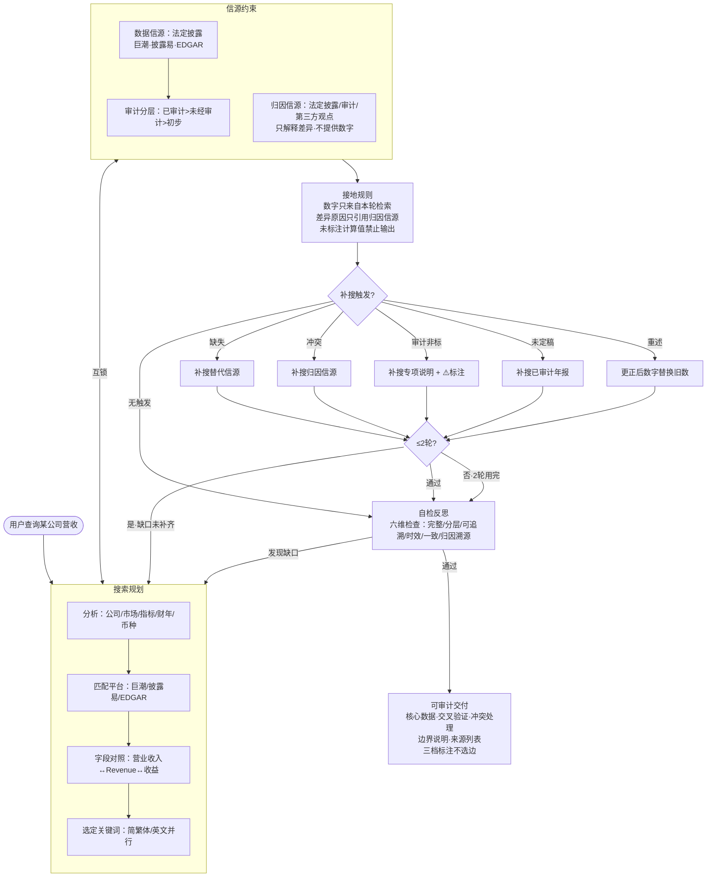

# 可信检索 Skill

> **官方优先，多源验证。无源不输出，缺数不妄言，冲突不站队。**

一个让 Agent 可靠检索数据的 Skill 集。核心不是「能搜到数据」，而是「搜到的数据可信、可追溯、可审计」。当前覆盖人口统计和上市公司销售数据两个窄领域——两个 Skill 共用六模块架构，各自替换信源清单和检索策略。

---

## 可用 Skill

### 人口数据检索

> 先规划后检索：官方优先，多源验证。

覆盖全球各国总人口、出生率、死亡率、预期寿命、年龄结构、城镇化率。信源从国家统计局到联合国人口司，6 级白名单 + 独立性判定。

→ [SKILL.md](./人口数据/SKILL.md) | [测试报告（四个场景）](./人口数据/测试报告-v1.2.md) | [设计总结](./人口数据/设计总结.md)

### 上市公司销售数据检索

> 法定披露为锚，归因引用为证。观点不当数据，冲突不替用户选边。

覆盖 A 股/港股/美股上市公司营业收入。数据信源 ⊕ 归因信源分离，审计状态分层，5 触发器补搜，三档标注交付。

→ [SKILL.md](./上市公司销售数据/SKILL.md) | [测试实录（六个场景）](./上市公司销售数据/测试实录.md)

---

## 快速开始

1. 下载 Skill → [GitHub Releases](https://github.com/paperpoon-lang/trusted-retrieval-skills/releases)
2. 放入 Agent 的 `skills/` 目录
3. 直接问：「中国 2024 年总人口」「贵州茅台 Q2 单季营收」「阿里巴巴最新财年营收」

支持所有遵循 [Anthropic Agent Skills 开放标准](https://github.com/anthropics/skills) 的 Agent 工具。

---

## 架构

两个 Skill 共用同一套六模块架构——搜什么、在哪搜、怎么验证、怎么交付，流程一致；每个 Skill 只替换领域特定内容（信源白名单、检索关键词、触发规则）。

### 两个 Skill 的模块差异

| 模块 | 人口数据 | 上市公司销售数据 |
|------|---------|----------------|
| **信源约束** | 6 级官方信源（国家统计局→国际组织→学术） | 数据信源（法定披露）⊕ 归因信源（公司自述/审计/第三方），审计状态分层 |
| **搜索规划** | 国家/指标/时间/粒度 + 本地化关键词 | 公司/市场/指标/财年口径/币种 + A/港/美股字段名对照 |
| **接地规则** | 数字只来自本轮检索 | 同上 + 差异原因只从归因信源引用，禁止自行推理 |
| **补搜机制** | 门控 2 轮 + 学术库强制触发（TFR 等高敏感指标） | 5 触发器（重述/未定稿/审计非标/冲突/缺失） |
| **自检反思** | 五维检查 | 五维 + 第六维差异归因溯源 |
| **可审计交付** | 结构化输出 + 溯源 URL | 同上 + 三档标注（法定披露/第三方·审计/第三方观点） |

### 上市公司销售数据检索 · 模块内流程

---

## 为什么这样设计

每个模块都是从一个具体的失败模式倒推出来的——先问「它在什么情况下算废了」，再问「怎么防住」。

| 失败模式 | 倒推出的设计决策 | 对应模块 |
|----------|-----------------|---------|
| Agent 搜了百度百科当权威数据 | 信源白名单 + 分级，禁止非官方信源 | 信源约束 |
| Agent 用训练数据「记得」的数字回答 | 接地规则：只能输出本轮实际检索到的内容 | 接地规则 |
| 一个信源搜不到就报告「未找到」 | 门控补搜：每轮明确缺口，最多 2 轮 | 补搜机制 |
| 两个同机构子站被当独立信源 | 独立性判定：识别为同一机构 → 补搜第三方 | 信源约束 |
| 官方未公布，Agent 随便填个数 | 官方未公布 ≠ 检索失败 → 标注缺失 + 替代方案 | 接地规则 |
| 数据打架，Agent 悄悄选了一个 | 冲突不站队：同时呈现 + 标注差异 | 可审计交付 |
| 券商研报预测数被当实际营收 | 数据/归因分离：观点不能提供数字 | 信源约束 |
| 计算值冒充直接披露数字 | `[计算值]` 标注 + 原始披露溯源 | 接地规则 |

---

## 借鉴了什么

不重复造轮子。每一处设计都是从已有成熟方案中提取、取舍、适配。

| 来源 | 借鉴了什么 | 如何取舍 |
|------|-----------|---------|
| **Anthropic Agent Skills Spec** | SKILL.md 文件格式；三级渐进加载 | 直接遵循开放标准，保证跨工具兼容 |
| **Pickaxe Grounding Stack** | 三层验证架构；「模型永不凭记忆回答」；六条引用规则 | 借鉴为「接地规则」独立模块 + 可审计交付 |
| **OpenAI GPT-5.6 Prompting Guide** | 精简优先；约束代替判断；完成后自我验证 | 指令写法：结构精简；触发条件用「约束代替判断」 |
| **Agentic RAG 企业指南** | Plan→Retrieve→Act→Reflect→Cite 核心循环 | Reflect →「自检反思」模块 |
| **Anthropic skill-creator** | 写 Skill 的方法论：意图→草稿→测试→迭代 | 完整工作流：设计→编写→测试→多轮迭代 |
| **Anthropic Financial Services** | SEC Filings 字段映射表（Revenue↔Net Sales↔营业收入） | 借鉴为搜索规划的「字段名对照」表 |
| **Agent GSR** | 门控补充检索（ReAct 工程化变体） | 直接复用为「补搜机制」，解绑沙利文特定管线 |
| **学术信息素养（三角验证）** | 至少三个独立可信来源交叉验证 | 借鉴为「至少 2 个独立信源」+ 独立性判定 |

---

## 已知局限

1. **二次报道依赖**：部分国家官方站点难以访问时，依赖国家级通讯社转载，标注 `[引用]` 但可靠性低于直接官方页。
2. **URL 可访问性**：Agent 无法预判链接是否被墙或失效。
3. **同源判定靠启发式**：域名/机构名比对是启发式，极端情况可能误判。
4. **小盘/冷门标的归因覆盖不足**：零券商覆盖的公司，「未找到公开归因分析」标注已设计但实测中未触发（属于已知未测项）。

这些局限均已在各 Skill 指令和测试报告中显式记录，不掩盖。

---

## 许可

MIT
