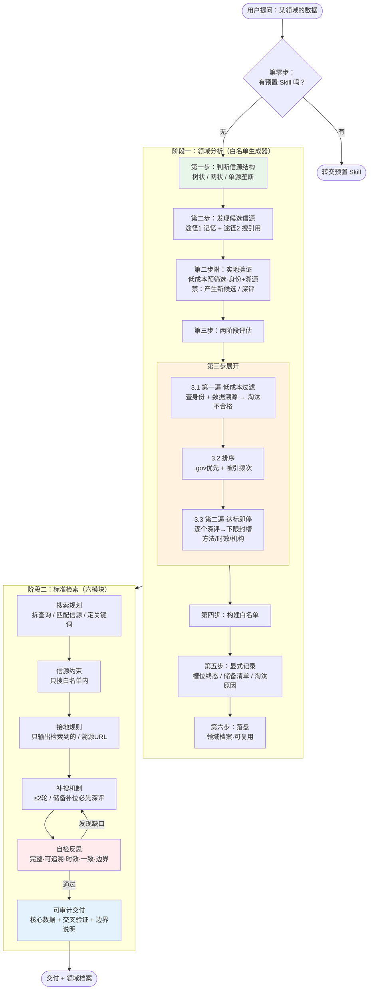

# 元层次 Skill 架构图

## 图例

| 颜色 | 含义 |
|------|------|
| 🟢 绿 | 领域分析（本 Skill 的创新点） |
| 🟠 橙 | 两阶段评估（成本控制核心） |
| 🔴 红 | 自检反思（PAPER 认为最易翻车） |
| 🔵 蓝 | 交付（最终产出） |

## 关键回路

- **阶段一内部**：途径 3 实地检查的结果可以回补途径 1/2 的候选发现
- **阶段二内部**：自检发现缺口 → 回到补搜（共享 ≤2 轮预算）
- **跨阶段**：补搜时缺口在白名单内无法填补 → 启用阶段一留下的储备清单补位
- **跨会话**：领域档案落盘后，下次同领域查询直接复用，跳过阶段一
